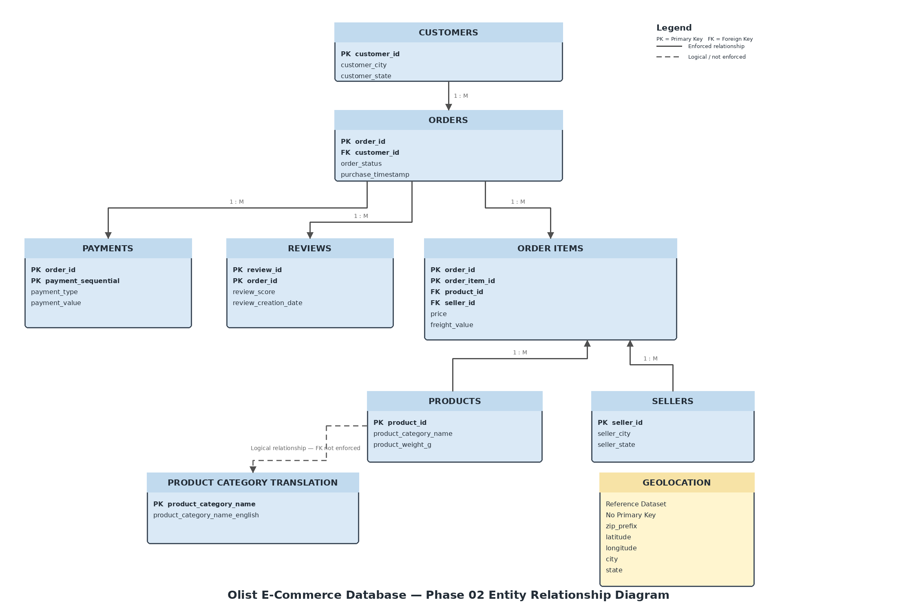

# Phase 02 - Database Design

## Project Information

| Attribute | Details |
|----------|---------|
| **Project** | Olist E-Commerce Business Analysis |
| **Phase** | Phase 02 - Database Design |
| **Status** | ✅ Completed |
| **Tools** | PostgreSQL, pgAdmin 4, SQL, Git, GitHub |

---

# Overview

Phase 02 focuses on designing and implementing the operational PostgreSQL database that serves as the foundation for all subsequent business analysis.

Rather than simply importing CSV datasets into PostgreSQL, this phase emphasizes relational database design, candidate key validation, business rule validation, data quality assessment, and the implementation of database constraints only where supported by the source data.

The completed database accurately represents both the structure and quality of the original Olist dataset while preserving important source data characteristics for future analytical processing.

---

# Objectives

The objectives of this phase were to:

- Design a relational PostgreSQL database from the raw Olist datasets.
- Create business-aligned database tables using appropriate PostgreSQL data types.
- Import and validate all source datasets.
- Identify suitable primary keys through candidate key analysis.
- Establish referential integrity where supported by the source data.
- Investigate source data quality before implementing constraints.
- Produce reusable SQL validation scripts and technical documentation.

---

# Database Design Methodology

Each table was implemented using the following standardized workflow.

1. Business Discovery
2. Table Design
3. Data Import
4. Data Validation
5. Candidate Key Validation
6. Data Quality Assessment
7. Business Rule Validation
8. Constraint Implementation *(where supported)*
9. Documentation
10. Version Control

This methodology mirrors real-world database implementation projects where structural constraints are applied only after imported data has been validated.

---

# Database Architecture

### Database

```text
olist_business_analysis
```

### Schema

```text
olist
```

All project tables are stored within the dedicated `olist` schema to logically separate project objects from PostgreSQL's default `public` schema.

All SQL scripts use schema-qualified table names (for example, `olist.customers`) to improve readability, maintainability, and consistency.

---

## Entity Relationship Diagram



---

# Key Design Decisions

One of the primary objectives of this phase was to validate the imported data before implementing database constraints. Rather than assuming relationships, every primary key and foreign key was verified against the source dataset.

### Reviews

Validation confirmed that neither `review_id` nor `order_id` uniquely identified review records.

Candidate key analysis determined that the combination:

```text
(review_id, order_id)
```

uniquely identifies every review.

**Design Decision**

- Composite Primary Key implemented.

---

### Payments

Business rule validation confirmed that a single customer order may contain multiple payment transactions.

The combination:

```text
(order_id, payment_sequential)
```

accurately represents this business relationship.

**Design Decision**

- Composite Primary Key implemented.

---

### Geolocation

Candidate key validation confirmed that:

- ZIP prefixes are not unique.
- Latitude and longitude combinations are not unique.
- Duplicate business records exist within the source dataset.

No reliable natural primary key exists.

**Design Decision**

The dataset was intentionally preserved in its original form without implementing database constraints.

---

### Product Category Translation

Candidate foreign key validation identified category values referenced within the `products` table that do not exist within the translation lookup table.

Rather than modifying the original source dataset, referential integrity was intentionally not enforced.

**Design Decision**

- Primary Key implemented.
- Foreign Key intentionally omitted.
- Data quality issue documented.

---

# Database Summary

| Table | Status |
|--------|--------|
| Customers | ✅ Imported, Validated & Constrained |
| Orders | ✅ Imported, Validated & Constrained |
| Order Items | ✅ Imported, Validated & Constrained |
| Products | ✅ Imported, Validated & Constrained |
| Sellers | ✅ Imported, Validated & Constrained |
| Payments | ✅ Imported, Validated & Constrained |
| Reviews | ✅ Imported, Validated & Constrained |
| Geolocation | ✅ Imported & Validated *(No constraints implemented)* |
| Product Category Translation | ✅ Imported & Validated *(Primary Key only)* |

---

# Validation Strategy

Each imported dataset was validated through the following checks.

- Successful import
- Record count verification
- Table structure verification
- Candidate key validation
- Business rule validation
- Data quality assessment
- Constraint verification *(where applicable)*

Separating validation from implementation allows the database design to be independently verified throughout the project lifecycle.

---

# Project Deliverables

Phase 02 produced the following deliverables.

- PostgreSQL relational database
- Dedicated PostgreSQL schema
- Imported Olist datasets
- Primary and foreign key implementation scripts
- SQL validation scripts
- Validation documentation

---

# Supporting Documentation

| Document | Description |
|----------|-------------|
| `sql/validation.sql` | SQL validation queries |
| `sql/database_constraints.sql` | Database constraint implementation |
| `validation/validation_notes.md` | Validation observations and design decisions |

> Additional documentation including the Entity Relationship Diagram (ERD), Candidate Key Analysis, Data Quality Findings, Business Discovery, and Data Dictionary will be added as Phase 02 enhancement artifacts.
> Candidate key analysis is documented in:

`validation/candidate_key_analysis.md`

---

# Lessons Learned

Phase 02 reinforced several important database design principles.

- Database constraints should be implemented only after validating imported data.
- Candidate key analysis is essential before selecting primary keys.
- Business rules should be validated using actual data rather than assumptions.
- Source data quality issues should be documented rather than hidden.
- Referential integrity should only be enforced when supported by the dataset.

These principles resulted in a database design that accurately reflects both the structure and quality of the original Olist dataset.

---

# Outcome

Phase 02 successfully transformed the raw Olist CSV datasets into a structured PostgreSQL database suitable for business analysis.

Rather than assuming relationships, every primary key and foreign key was validated using imported data before implementation. Where the source data did not support a database constraint, the issue was investigated, documented, and preserved instead of modifying the original dataset.

The completed database provides a reliable operational foundation for exploratory data analysis, business intelligence, and dashboard development in the subsequent phases of this project.

---

# Next Phase

## Phase 03 - Exploratory Data Analysis

The next phase will focus on:

- Exploring the imported datasets using SQL
- Profiling data quality
- Answering business questions
- Generating business insights
- Preparing analytical datasets for reporting and dashboard development